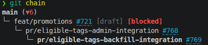

# git chain

Mostra a cadeia de branches (stack de PRs) da branch atual até a `main`.



## Uso

```bash
git chain [<branch> | <numero-da-PR>] [--no-color] [--inline] [--no-pr] [--text | --json]
```

## Descrição

Percorre a branch atual até a branch raiz (`main`/`master`, ou a default
branch do remote), resolvendo o parent de cada branch pela base declarada da
PR (`gh pr view --json baseRefName`). Sem PR aberta, cai no fallback:
branch com merge-base mais recente que não seja a própria ponta da branch
atual (evita confundir filho/irmão com parent real).

Passando um nome de branch ou número de PR como argumento, mostra a cadeia a
partir dessa branch em vez da atual - sem precisar dar checkout nela.
Número de PR exige `gh`+`jq` instalados (resolve a branch via
`gh pr view <numero> --json headRefName`). Marcadores que só fazem sentido
pra branch com checkout de fato feito (`[dirty working tree]`, rebase/merge
em andamento) só aparecem se a branch consultada for a mesma que está com
checkout - se você consulta outra branch, esses marcadores somem dessa
entrada.

Sem `gh` (ou `jq`) instalado, ou com `gh` instalado mas sem login, o script
funciona normalmente mas sem nenhum dado de PR (`#NNN`, approvals,
comentários, diffstat etc) - imprime um aviso em stderr avisando o que falta
instalar/configurar pra ter a experiência completa. Não aparece com
`--no-pr` (que já dispensa PR de propósito) nem com `--text`.

Pra cada branch na cadeia mostra, quando aplicável:

| Marca | Significado |
|---|---|
| `#NNN` | número da PR, clicável em terminais com suporte a hyperlink OSC 8 (iTerm2, kitty, VSCode, gnome-terminal) |
| `▲N` | N commits locais não enviados pro remote (unpushed) |
| `▼N` | N commits no remote ainda não trazidos (não pulled) |
| `[X]` | branch sem remote (nunca deu push) |
| `[só remoto]` (`[só remoto via <remote>]` se não for `origin`) | branch só existe no remote, nunca teve checkout local (achada como parent via PR ou heurística) |
| `[📄N +A/-D]` | PR (aberta ou fechada) tem N arquivos alterados, A linhas adicionadas (verde), D removidas (vermelho) |
| `[draft]` | PR ainda em draft |
| `[merged]` | PR dessa branch já foi mergeada |
| `[closed sem merge]` | PR foi fechada sem merge (abandonada) |
| `[PR CONFLICTING]` | PR aberta tem conflito de merge |
| `[👍N/M]` (`[✓N/M]` sem cor) | PR aberta tem N approvals de M revisores designados no total (quem já revisou + quem foi pedido e ainda não revisou; só a revisão mais recente de cada um conta). Com `--no-color`/fora de terminal vira `✓` - emoji tem cor própria e não respeita `NO_COLOR` |
| `[💬N]` | PR aberta tem N comentários (issue comments, não inclui review comments inline) |
| `[blocked]` | PR aberta bloqueada pra merge (checks/aprovação faltando, branch protection etc) |
| `[REBASE\|MERGE\|CHERRY-PICK\|BISECT IN PROGRESS]` | branch atual com uma dessas operações em andamento |
| `[dirty working tree]` | branch atual tem mudanças trackeadas não commitadas (untracked não conta) |

PR fechada sem merge (`CLOSED`) não é usada como fonte do parent na cadeia -
só PR aberta ou já mergeada são confiáveis pra isso; `CLOSED` cai no
fallback heurístico (a branch pode ter seguido outro rumo).

Mesmo com PR aberta/mergeada, a base declarada é validada contra o
histórico local (mesma heurística de merge-base do fallback): se a branch
foi rebasada pra outro parent sem atualizar a base da PR no GitHub, aparece
um aviso em stderr - a cadeia continua usando a base declarada da PR, só
avisa da divergência.

Roda `git fetch --all --quiet` antes de comparar ahead/behind, então os
números refletem o estado real dos remotes no momento da execução.

**Múltiplos remotes** (ex: `origin` + `upstream` de um fork): cada branch usa
seu upstream configurado (`git branch --set-upstream`), se houver; senão o
script procura o nome da branch em cada remote, preferindo `origin` quando
existir. A raiz da cadeia (`main`/`master`) usa o `HEAD` do primeiro remote
resolvível, mesma ordem de preferência. Quando o remote de uma branch não é
`origin`, isso aparece no marcador (`via <remote>`) e no campo `remote` do
`--json`.

Se a cadeia não conseguir chegar até a raiz (parent não resolvido nem por PR
nem pela heurística), imprime um aviso em stderr e mostra a cadeia truncada
até onde conseguiu.

Saída colorida (bold no HEAD/main, cyan no `#PR`, amarelo `▲`, vermelho
`▼`/`[X]`) quando rodado em terminal interativo; sem cor se a saída for
redirecionada/pipada. O link OSC 8 do `#PR` só é emitido em terminal
interativo (nunca em saída redirecionada/pipada, mesmo com cor).

## Opções

| Flag | Efeito |
|---|---|
| `<branch>` | mostra a cadeia a partir dessa branch (local ou remota), sem checkout |
| `<numero-da-PR>` | mostra a cadeia a partir da branch dessa PR (resolvida via `gh`). Só um dos dois - branch ou número - por vez |
| `-h` | mostra a ajuda embutida no script |
| `--no-color` | desabilita cores (mesmo efeito de `NO_COLOR=1`) |
| `--inline` | mostra a cadeia em uma linha só (com setas `→`) em vez do modo árvore (padrão, raiz no topo). Só mostra nome da branch, `#NNN` e ahead/behind (`▲`/`▼`) - sem draft, merged, closed, conflicting, diffstat, approvals, comentários, blocked, dirty working tree etc (esses ficam só no modo árvore) |
| `--no-pr` | esconde tudo relacionado a PR (`#NNN`, draft, merged, closed, conflicting, approvals, blocked) - só a hierarquia de branches + ahead/behind/`[X]`. A cadeia continua usando o `gh` por baixo dos panos pra resolver o parent correto, só a exibição fica mais limpa |
| `--text` | só os nomes das branches, um por linha, raiz primeiro - sem cor, sem `#PR`, sem ahead/behind. Pra uso em scripts (ex: `git chain --text \| while read -r b; do ...; done`). Ignora `--no-color`/`--inline`/`--no-pr`/`--json` |
| `--json` | array JSON com detalhes de cada branch (raiz primeiro): `name`, `is_current`, `is_root`, `pr` (`null` se não houver PR, senão `number`, `url`, `state`, `draft`, `mergeable`, `approvals`, `reviewers_total`, `merge_status`, `comments`, `changed_files`, `additions`, `deletions`), `has_local`, `has_remote`, `remote` (nome do remote onde a branch foi encontrada, `null` se `has_remote` for `false`), `ahead`, `behind`, `local_conflict` e `dirty_worktree` (os dois últimos só preenchidos na branch atual). Exige `jq` instalado. Combina com `--no-pr` (`pr` vira `null` em todas). Ignora `--no-color`/`--inline`/`--text` |

> `git chain --help` não funciona - o git intercepta `--help` para qualquer
> alias e imprime só a definição dele, sem executar. Use `-h`.

## Requisitos

- **Obrigatório:** `git` (uso local do repo) e `bash`.
- **Opcional:** `gh` CLI autenticado + `jq` (usado só pra parsear a saída do
  `gh`). Sem os dois, `git chain` funciona igual, mostrando só a hierarquia
  local de branches (sem número/status de PR). Se `gh` estiver ausente, o
  script pula essas chamadas e nunca invoca `jq` - por isso os dois são
  opcionais juntos, não um sem o outro.
- **`--json` exige `jq`** (não é mais opcional nesse modo específico) - sem
  ele o script sai com erro antes de resolver a cadeia.

## Exemplos

```bash
$ git chain
main
└─ branch-base #767
   └─ minha-branch #768 (▼6)

# modo uma linha só (main primeiro, igual árvore)
$ git chain --inline
main (▼6) → branch-base #767 → minha-branch #768

# cadeia de outra branch, sem dar checkout nela
$ git chain minha-branch
main
└─ branch-base #767
   └─ minha-branch #768 (▼6)

# cadeia a partir do número da PR
$ git chain 768

# sem cores (--no-color equivale a NO_COLOR=1)
$ git chain --no-color
main
└─ branch-base #767
   └─ minha-branch #768 (▼6)

# só os nomes, raiz primeiro, um por linha
$ git chain --text
main
branch-base
minha-branch

# detalhes em JSON
$ git chain --json
[
  {"name": "main", "is_current": false, "is_root": true, "pr": null, ...},
  {"name": "minha-branch", "is_current": true, "is_root": false,
   "pr": {"number": 768, "url": "...", "state": "OPEN",
          "approvals": 1, "reviewers_total": 2, "comments": 3,
          "changed_files": 5, "additions": 42, "deletions": 7, ...}, ...}
]
```

## Estrutura

```
git/chain/
├── script.sh                 # entrypoint: parsing, resolução da cadeia, impressão
└── lib/
    ├── git.sh                 # helpers de git puro (remotes, refs, estado local, cache de PR)
    ├── provider.sh            # dispatcher do provider de PR ativo (interface genérica)
    └── providers/
        └── github.sh          # provider GitHub (via `gh`+`jq`) - único hoje
```

Dados de PR (`#NNN`, approvals, comentários, diffstat etc) vêm de um
**provider** plugável, não direto de `gh`. `script.sh` e `lib/git.sh` só
chamam a interface genérica em `lib/provider.sh` (`pr_provider_available`,
`pr_provider_fetch_pr_info`, `pr_provider_resolve_pr_branch`,
`pr_provider_deps_hint`, `pr_provider_label`) - nunca `gh`/`jq` direto.

Pra suportar outro host de PR (ex: GitLab):

1. Criar `lib/providers/gitlab.sh` com as funções `gitlab_available`,
   `gitlab_deps_hint`, `gitlab_fetch_pr_info`, `gitlab_resolve_pr_branch`,
   seguindo a mesma assinatura de `github.sh` (populam as arrays `pr_*`
   declaradas em `lib/git.sh`).
2. Em `lib/provider.sh`: adicionar `source` do novo arquivo e um `case` em
   cada função `pr_provider_*` apontando pro provider certo (hoje é fixo em
   `github`; dá pra decidir por variável de ambiente `GIT_CHAIN_PROVIDER`
   ou detectar pelo host do remote).

Nenhum outro arquivo precisa mudar - a cadeia, o fallback heurístico e toda
a impressão (`tree`/`--inline`/`--text`/`--json`) já são agnósticos de
provider.
