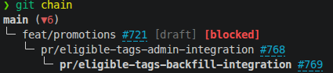

# git chain

Mostra a cadeia de branches (stack de PRs) da branch atual até a `main`.



## Uso

```bash
git chain [<branch> | <numero-da-PR>] [--no-color] [--inline] [--no-pr] [--no-warning] [--text | --json]
```

## Descrição

Percorre a branch atual até a raiz (`main`/`master`), resolvendo o parent de
cada branch pela base declarada da PR (`gh pr view --json baseRefName`) -
sem PR aberta, cai num fallback heurístico por merge-base.

Passando um nome de branch ou número de PR como argumento, mostra a cadeia
a partir dela em vez da atual - sem precisar dar checkout.

Cada branch na cadeia pode mostrar número da PR, ahead/behind, draft,
merged, approvals, comentários, conflitos etc. Ver [DETAILS.md](https://github.com/carlosdorneles-mb/dev-toolbox/blob/main/git/chain/DETAILS.md#marcas-na-saída)
pra tabela completa de marcas.

## Opções

| Flag | Efeito |
|---|---|
| `<branch>` | mostra a cadeia a partir dessa branch (local ou remota), sem checkout |
| `<numero-da-PR>` | mostra a cadeia a partir da branch dessa PR (resolvida via `gh`). Só um dos dois por vez |
| `-h` | mostra a ajuda embutida no script |
| `--no-color` | desabilita cores (mesmo efeito de `NO_COLOR=1`) |
| `--inline` | mostra a cadeia em uma linha só (setas `→`), sem os detalhes extras do modo árvore |
| `--no-pr` | esconde tudo relacionado a PR, só hierarquia + ahead/behind/`[X]` |
| `--no-warning` | silencia os avisos em stderr |
| `--text` | só os nomes das branches, um por linha, raiz primeiro - pra uso em scripts |
| `--json` | array JSON com detalhes de cada branch. Exige `jq` |

> `git chain --help` não funciona - git intercepta `--help` pra qualquer
> alias. Use `-h`.

## Exemplos

```bash
$ git chain
main
└─ branch-base #767
   └─ minha-branch #768 (▼6)

$ git chain --inline
main (▼6) → branch-base #767 → minha-branch #768

$ git chain minha-branch      # cadeia de outra branch, sem checkout
$ git chain 768                # cadeia a partir do número da PR
$ git chain --text
main
branch-base
minha-branch
```

Mais detalhes (tabela completa de marcas, resolução de parent, múltiplos
remotes, comportamento sem `gh`/`jq`, estrutura interna e como plugar outro
provider de PR) em [DETAILS.md](https://github.com/carlosdorneles-mb/dev-toolbox/blob/main/git/chain/DETAILS.md).
