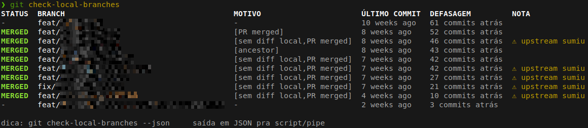

# git check-local-branches

Lista branches locais já mergeadas no remote (`origin` por padrão), com
opção de apagar as encontradas.



## Uso

```bash
git check-local-branches [--delete [--yes]] [--only-merged] [--only-stale] [--stale-days N] [--no-fetch] [--no-color] [--json]
```

## Descrição

Pra cada branch local (exceto a raiz `main`/`master`), verifica se o
conteúdo dela já foi integrado na branch raiz do remote, por 3 métodos
(qualquer um confirma merge):

1. **ancestor** - branch é ancestral direto da raiz (merge normal, merge
   `--ff-only`, ou merge commit preservando histórico).
2. **sem diff local** - `git cherry` mostra que todo commit da branch já
   tem equivalente (mesmo patch-id) na raiz - cobre merge via rebase que
   reaplica commit a commit.
3. **PR merged** - PR da branch (via `gh`) está com `state=MERGED` - único
   jeito confiável de detectar squash merge (1 commit novo na raiz, sem
   ancestral nem patch-id batendo com nenhum commit da branch).

Sem `gh`/`jq` instalados (ou sem login), o método 3 é pulado - branch
squash-mergeada pode aparecer como "não mergeada" nesse caso (avisa 1x em
stderr, mesmo aviso do `git chain`).

Branch com upstream remoto sumido (`git branch -vv` mostra `[gone]`) é
sinal extra, mostrado na coluna `NOTA` (não em `MOTIVO`) - não é usado
sozinho pra decidir merge, só reforça o resultado dos 3 métodos acima.

`DEFASAGEM` mostra quantos commits a branch está atrás da raiz
(`git rev-list --count <branch>..<raiz>`) - "em dia" quando 0, útil pra
saber se uma branch não-mergeada só está velha ou já ficou pra trás de
verdade.

**stale**: idade calculada pela data do último commit da branch
(`git log -1 --format=%ct`) - marca `⚠ stale` na coluna `NOTA` quando
maior que `--stale-days` (default: 90), independente de estar mergeada
ou não. `--only-merged`/`--only-stale` filtram exibição e candidatos de
`--delete` pro respectivo critério (AND quando os dois são passados
juntos - só sobra quem for mergeada **e** stale ao mesmo tempo).

### Deleção

`--delete` remove (`git branch -D`) branches locais. Sem `--yes`, mostra
**todas as candidatas** (já filtradas por `--only-merged`/`--only-stale`,
se passados) num seletor `gum choose --no-limit` (espaço marca, enter
confirma); depois lista as escolhidas e confirma via `gum confirm` antes
de apagar de fato. Exige terminal interativo e `gum` instalado, sem
fallback (erro com instrução de instalação se faltar qualquer um dos
dois).

`--yes`/`-y` pula seleção/confirmação e apaga direto, mas só as
consideradas **seguras** - critério muda conforme as flags:

| Flags usadas junto com `--delete --yes` | O que é "seguro" (apagado sem revisão) |
|---|---|
| nenhuma, ou `--only-merged` | só **mergeada** |
| `--only-stale` | **mergeada OU stale** (o pedido explícito de `--only-stale` habilita stale como critério seguro também) |
| `--only-merged --only-stale` | só quem for **mergeada e stale ao mesmo tempo** (herda o AND da filtragem acima) |

Ou seja: `--delete --yes` sozinho nunca apaga stale-não-mergeada -
precisa passar `--only-stale` explicitamente pra isso entrar no critério
seguro. Sem `--yes`, qualquer candidata (mergeada, stale, ou nenhuma das
duas) aparece no seletor `gum choose` pra escolha manual - a decisão de
apagar uma branch fora do critério seguro sempre passa por revisão
humana ali. Nunca deleta a branch raiz nem a branch com checkout no
momento (protegida pelo próprio git contra deleção).

Enquanto verifica (fetch + consulta PR por branch), mostra um spinner
via `gum spin` com o texto "verificando branches locais..." (só em
terminal interativo, sem `--json`).

Roda `git fetch --all --quiet --prune` antes de comparar, a menos que
`--no-fetch` seja passado (usa o que já está local - mais rápido, pode
estar desatualizado).

## Opções

| Flag | Efeito |
|---|---|
| `--delete` | mostra todas as branches locais (filtradas pelas flags acima) num seletor `gum` pra apagar (obrigatório sem `--yes`) |
| `--yes`, `-y` | junto com `--delete`, apaga direto as "seguras" sem seleção/confirmação - mergeadas sempre; +stale também se `--only-stale` for passado (ver tabela em [Deleção](#deleção)) |
| `--only-merged` | mostra/considera só branches mergeadas |
| `--only-stale` | mostra/considera só branches stale |
| `--stale-days N` | idade em dias do último commit acima da qual marca "stale" (default: 90) |
| `--no-fetch` | pula o `git fetch` antes de comparar |
| `--no-color` | desabilita cores (mesmo efeito de `NO_COLOR=1`) |
| `--json` | array JSON com `{name, merged, reasons, gone, age_days, stale}` por branch (exige `jq`) |
| `-h` | mostra a ajuda embutida |

## Exemplos

```bash
$ git check-local-branches
STATUS  BRANCH                                       MOTIVO       ÚLTIMO COMMIT  DEFASAGEM         NOTA
MERGED  fix/promotions-mail-push-campaign-exclusion  [PR merged]  3 weeks ago    em dia            upstream sumiu
MERGED  chore/bump-deps                              [ancestor]   2 months ago   em dia
-       feat/promotions-autonomous-process           -            2 days ago     12 commits atrás  branch atual

$ git check-local-branches --delete
STATUS  BRANCH                                       MOTIVO
MERGED  fix/promotions-mail-push-campaign-exclusion  [PR merged] (upstream sumiu)
MERGED  chore/bump-deps                              [ancestor]
-       feat/wip-experimento                         [não mergeada]
# abre gum choose com TODAS - espaço marca, ENTER confirma
Selecionadas pra apagar:
  - fix/promotions-mail-push-campaign-exclusion
# gum confirm antes de apagar de fato
Deleted branch fix/promotions-mail-push-campaign-exclusion (was 621e441).

$ git check-local-branches --delete --yes
STATUS  BRANCH                                       MOTIVO
MERGED  fix/promotions-mail-push-campaign-exclusion  [PR merged] (upstream sumiu)
# --yes apaga direto, sem seleção/confirmação
Deleted branch fix/promotions-mail-push-campaign-exclusion (was 621e441).

$ git check-local-branches --json
[
  {"name": "fix/promotions-mail-push-campaign-exclusion", "merged": true,
   "reasons": ["PR merged"], "gone": true, "age_days": 21, "stale": false},
  {"name": "feat/promotions-autonomous-process", "merged": false,
   "reasons": [], "gone": false, "age_days": 2, "stale": false}
]

$ git check-local-branches --only-stale --stale-days 30
STATUS  BRANCH               MOTIVO  ÚLTIMO COMMIT  DEFASAGEM  NOTA
-       chore/old-experiment  -       4 months ago   3 commits atrás  ⚠ stale

$ git check-local-branches --delete --yes
# sem --only-stale: "seguro" = só mergeada. chore/old-experiment (stale,
# não mergeada) NÃO é apagada mesmo aparecendo como stale na listagem acima.
STATUS  BRANCH                                       MOTIVO
MERGED  fix/promotions-mail-push-campaign-exclusion  [PR merged] (upstream sumiu)
Deleted branch fix/promotions-mail-push-campaign-exclusion (was 621e441).

$ git check-local-branches --delete --yes --only-stale --stale-days 30
# com --only-stale: "seguro" passa a incluir stale também - agora apaga.
STATUS  BRANCH                MOTIVO
-       chore/old-experiment  [stale]
Deleted branch chore/old-experiment (was a1b2c3d).
```

## Dependências

Reaproveita `git/chain/lib/` (`provider.sh`, `git.sh`) pra resolver a
branch raiz e consultar PR via `gh`+`jq` - mesma dependência opcional do
`git chain` (funciona sem, só perde o método 3).
